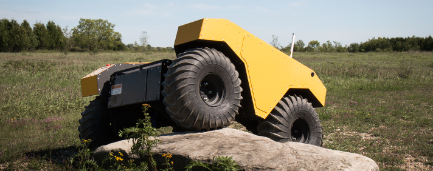
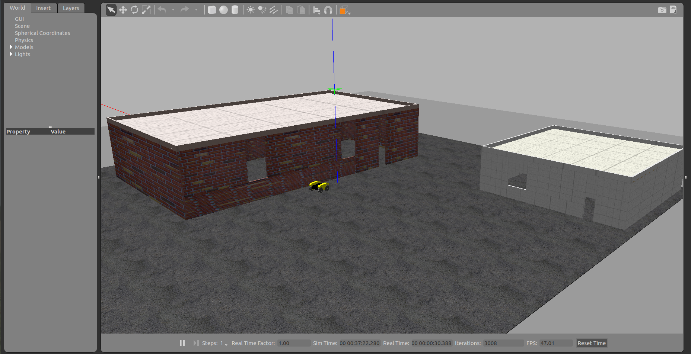

<div align="center"> <h1> Automated Material Transfer </h1> <br/>
 Stewart Lamon <br/> Yardley Ordonez <br/> Zahory Ramirez <br/> Nolan Spencer <br/><br/>
 <br/>
MECA 470 <br/> Fall 2020 <br/>
</div> <br/>

## Introduction 
The objective of this project was to simulate an Unmanned Ground Vehicle (UGV) that would be able to transfer material to different set of locations. To complete this simulation, Robot Operating System (ROS) Kinetic was utilized as the base environment for simulating an autonomous UGV. This group chose to emulate Clearpath Robotics' 
<a href="https://clearpathrobotics.com/warthog-unmanned-ground-vehicle-robot/"> Warthog UGV</a> 
and their 
<a href="http://www.clearpathrobotics.com/assets/guides/melodic/warthog/">online tutorials</a>. 
There were other software toolkits that were utilized for this project, and there will be further explanation of these toolkits.
<br/><br/>

<div align="center">
 
<br/><br/>  
</div>

Clearpath Robotics’ Warthog UGV was chosen due to its many features that would allow for it to be utilized in moderate weather conditions, max payload of 600 lbs and towing capacity of 1984 lbs. Another aspect that caught the attention of this group, was that it uses a 64-bit version of Ubuntu 16.04 or 18.04 LTS. The Warthog's onboard computer comes with ROS kinetic or melodic distribution preinstalled and configured.

## Software 
Below is a list of the software employed for this project with their respective links for downloading or acquiring more information: <br/>

<ul>
 <li>Virtual Machine</li>
 <ul>
  <li><a href="https://www.virtualbox.org/wiki/Downloads">Oracle Virtualbox</a></li>
 </ul> <br/>
 
 <li>Linux Operating System</li>
 <ul>
 <li><a href="https://releases.ubuntu.com/16.04/">Ubuntu 16.04 LTS</a></li> 
 </ul> <br/>
 
 <li>ROS Distribution</li>
 <ul>
  <li><a href="http://wiki.ros.org/kinetic">Kinetic Kame</a></li>
 </ul><br/>
 
 <li>3D Simulator</li>
 <ul>
 <li><a href="http://gazebosim.org/tutorials/?tut=ros_comm">Gazebo</a></li>
 </ul><br/>
 
 <li>3D Visualization Tool</li>
 <ul>
  <li><a href="http://wiki.ros.org/rviz">ROS-Visualization (RViz)</a></li>
 </ul><br/>
 
</ul>

## Installation
The installation process will be discussed in this section to provide some background. <br/><br/>

<i>1. Virtual Machine and Ubuntu Install</i><br/><br/>

<div align="center">
 
<br/><br/>  
</div>

Since the host operating system (OS) for computers utilized were windows, a Linux OS was needed to employ ROS. This team planned to use the Kinetic Kame ROS distribution. The first step was to download the Oracle Virtualbox for free and install onto respective computers. The next step was to download and install Ubuntu 16.04 LTS to use in the Virtualbox environment. For more information on setting up Ubuntu on Virtual box, please refer to the <a href="https://itsfoss.com/install-linux-in-virtualbox/">step by step tutorial</a>. 
<br/><br/>

<i>2. Kinetic Kame ROS Distro Install</i><br/><br/>

<div align="center">

<br/><br/>
</div> 

Once Ubuntu 16.04 LTS is successfully configured into the virtual environment, the next step was to install Kinetic Kame ROS distribution. For detailed steps on how to download Kinetic Kame ROS distribution on Ubuntu 16.04 LTS, please refer to the <a href="http://wiki.ros.org/kinetic/Installation/Ubuntu">ROS Kinetic installation guide</a>.
<br/><br/>

Once ROS Kinetic is installed, verify that ROS is installed by opening a new terminal (<kbd>Ctrl</kbd> + <kbd>Alt</kbd> + <kbd>T</kbd> : to open terminal in ubuntu) and typing in the following:<br/>
```
printenv | grep ROS
```
<br/>
If ROS Kinetic is not installed then refer back to the <a href="http://wiki.ros.org/kinetic/Installation/Ubuntu">ROS Kinetic installation guide</a> again or check other online resources related to installing ROS Kinetic such as the <a href="http://wiki.ros.org/">ROS Wiki</a>. If installed properly then proceed to <a href="http://wiki.ros.org/ROS/Tutorials/InstallingandConfiguringROSEnvironment">configuring the ROS environment</a>.
<br/><br/>

<i>3. Installing Warthog Software</i><br/><br/>

<div align="center">

<br/><br/>
</div> 

Once the ROS environment is setup, the next step is to install the Warthog through Clearpath Robotics’ <a href="https://www.clearpathrobotics.com/assets/guides/kinetic/warthog/WarthogInstallation.html">Warthog software installation guide</a>. It is recommended to only stop after completing the <a href="https://www.clearpathrobotics.com/assets/guides/kinetic/warthog/WarthogSimulation.html"> Launch RVIZ</a> section.
<br/><br/>

<i>4. Istalling Warthog_publisher </i><br/><br/>

Now that the Warthog’s workspace is successfully installed on the virtual machine, it is time to add the `warthog_publisher` to the Warthog workspace. This package allows for the user to set specific x and y-coordinate waypoints on Gazebo's map and will also command the Warthog to navigate to each of the listed points in order. Start by opening a new terminal window and changing the directory on the terminal by typing in the following: <br/>

```
cd ~/warthog_ws/src
```
<br/> Start cloning the node's repository by utilizing git:<br/>

```
git clone https://github.com/Spence115/warthog_publisher.git
```
<br/>Then change directory to the workspace and build:<br/>

```
cd ~/warthog_ws
catkin_make
```

<br/>Finally, be sure to source the worspace in order to use the packages that were just built: <br/>

```
source devel/setup.bash
```
<br/><br/>

## Application
At this point, it is time to simulate with the waypoint publisher. There will be detailed steps on how to use this package and describe what is going on behind the scenes. <br/>

The core of the `warthog_publisher` package is the `warthog_publisher_node.cpp` file. To determine the position of the Warthog, the `warthog_publisher_node` subscribes to the `gazebo/model_states` topic with the message type ` gazebo_msgs/ModelStates`. To find each coordinate, the node extracts the x and y coordinates from the "point" position inside of the `geometry_msgs/Pose[]` array. For more information on the structure of these topics visit <a href="http://docs.ros.org/en/jade/api/gazebo_msgs/html/msg/ModelStates.html">this website</a>.<br/>

After determining the Warthog’s position, the node changes the robot’s linear velocity and yaw by publishing to the `/cmd_vel` topic with the message type `geometry_msgs/Twist`. To move the robot to the desired position inside Gazebo. The node will continue publishing and will move the Warthog until it reaches a position that is within +/- 0.2 meters of the designated waypoint. Once it reaches the first waypoint, it will continue to navigate to each subsequent waypoint until it reaches the final waypoint written in the `warthog_publisher_node.cpp` file.<br/>

Now that there is an understanding of how the node works, there will be further discussion on how to use the node. First, open up a new terminal and enter the following: <br/>

```
roslaunch warthog_gazebo warthog_world.launch
```
<br/>It is important to note that any custom world launch file can be used. The launch file above is one provided by Clearpath Robotics’ and is already installed in the Warthog’s workspace. However, a custom world made by the group was used for the screenshots featured later on. To simulate in the custom world, be sure to install the launch file and world file located <a href="https://github.com/yardbear/MECA-470-Automated-Material-Transfer-Project/tree/master/Software/Code/Custom%20world%20files">here</a> and run the following command:<br/>

```
roslaunch warthog_gazebo MECA_470.launch
```
<br/>If Gazebo has launched properly, there should be a window similar to the following:<br/><br/>

<div align="center">
 
<br/><br/>  
</div>

To launch the publisher node, open up a second terminal and enter this line:<br/>

```
rosrun warthog_publisher warthog_publisher_node
```
<br/>To verify that the node is operating correctly, the Warthog begins travelling to each waypoint and the terminal windows look similar to the ones below:

<div align="center">
 
<br/><br/>  
</div>

##### more info to come

[](https://www.youtube.com/watch?v=KOxbO0EI4MA "Audi R8")

https://www.youtube.com/watch?v=mwTm3SYaEWY&feature=youtu.be&ab_channel=NolanSpencer
